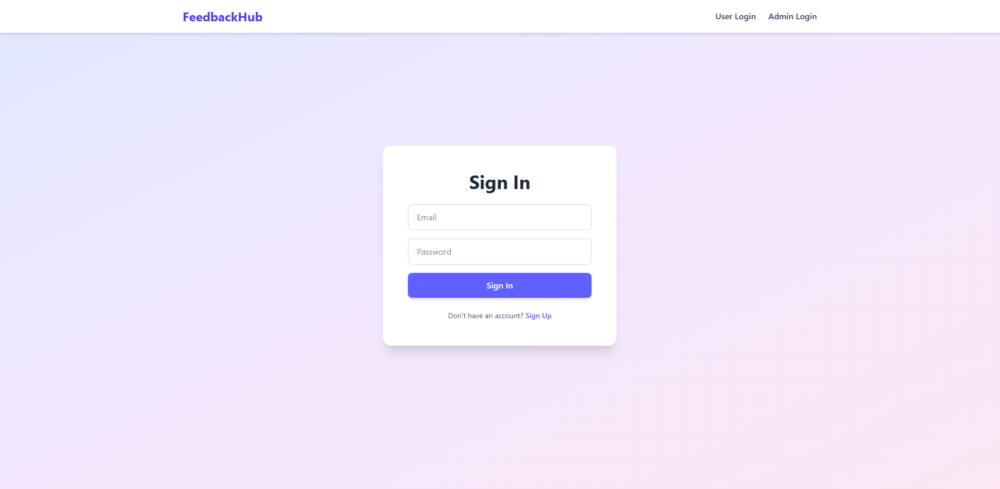
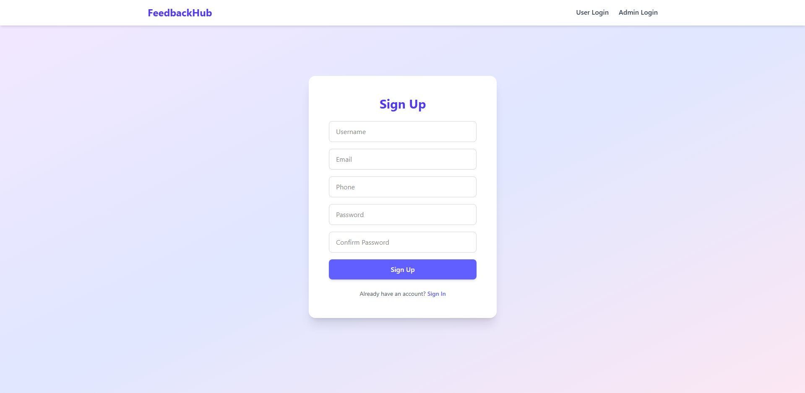
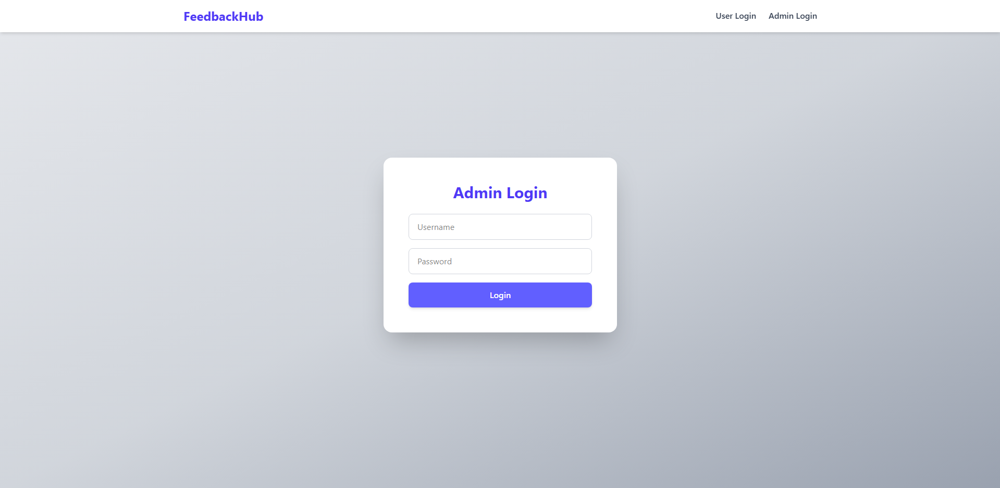
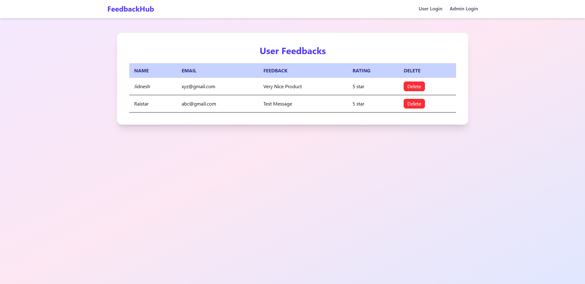

# 📝 FeedbackHub – Feedback Management System

FeedbackHub is a **full-stack web application** built with **React, Node.js, Express, and PostgreSQL**.
It allows users to submit feedback, view feedback lists, and provides role-based access for admins and users.

---

## 🚀 **Live Demo**

🔗 **Deployed App:** [https://feedback-hub-beta.vercel.app/](https://feedback-hub-beta.vercel.app/)

* Frontend: Vercel
* Backend: Render
* Database: PostgreSQL (hosted on Supabase)

---

## ✨ **Features**

* 📝 **Submit Feedback** – Users can submit feedback by providing their name, email, and message
* 👀 **View Feedbacks** – Admins can see all feedbacks in a dashboard
* ✅ **Role-based Access** – Users vs Admin functionality
* 📱 **Responsive Design** – Works on desktop, tablet, and mobile
---

## 🛠️ **Tech Stack**

### **Frontend:**

* React.js (Vite)
* Tailwind CSS
* React Router
* Axios

### **Backend:**

* Node.js + Express.js
* PostgreSQL (Relational Database)

---

## 📂 **Folder Structure**

```bash
FeedbackHub/
├── client/               # Frontend (React + Vite)
│   └── src/
│       ├── app/          # Application-level setup (Redux store)
│       ├── assets/       # Images, fonts, icons
│       ├── components/   # Reusable UI components
│       ├── pages/        # Route-level components
│       ├── services/     # API calls / service logic
│       ├── App.jsx       # Root React component
│       ├── main.jsx      # React DOM entry point
│       └── routes.jsx    # App routing configuration
├── server/               # Backend (Node.js + Express)
│   └── index.js          # Server entry point
```

---

## ⚙️ **Installation & Setup**

### 1. Clone the Repository

```bash
git clone https://github.com/jidneshmeher/FeedbackHub.git
cd FeedbackHub
```

### 2. Install Dependencies

* **Frontend (client)**

```bash
cd client
npm install
```

* **Backend (server)**

```bash
cd ../server
npm install
```

### 3. Configure Environment Variables

Both `client/` and `server/` contain `.env.sample` files. Copy them to `.env` and fill in your values.

* **Server (`server/.env`)**

```env
PORT=your_server_port
DB_HOST=your_database_host
DB_USER=your_database_user
DB_PASSWORD=your_database_password
DB_NAME=your_database_name
DB_PORT=your_database_port
NODE_ENV=development
BACKEND_URL=your_backend_url
```

* **Client (`client/.env`)**

```env
VITE_API_BASE_URL=your_api_base_url
```

### 4. Run the Development Server

* **Start the backend**

```bash
cd server
npm run dev
```

* **Start the frontend**

```bash
cd ../client
npm run dev
```

---

## 📸 **Screenshots**

### 🔑 Sign In Page


### 📝 Sign Up Page


### 🛠️ Admin Page


### 📝 Feedback Page


### 📋 Admin Details Page


---

## 👨‍💻 Author

**Jidnesh Meher**

* GitHub: [github.com/jidneshmeher](https://github.com/jidneshmeher)
* LinkedIn: [linkedin.com/in/jidneshmeher](https://linkedin.com/in/jidneshmeher)
* Email: [meherjidnesh89@gmail.com](mailto:meherjidnesh89@gmail.com)

---